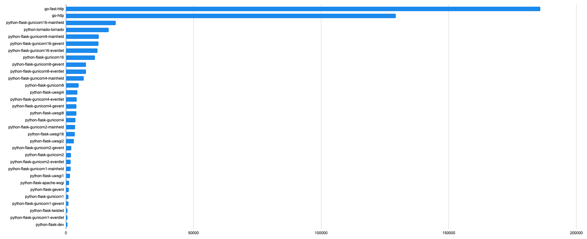
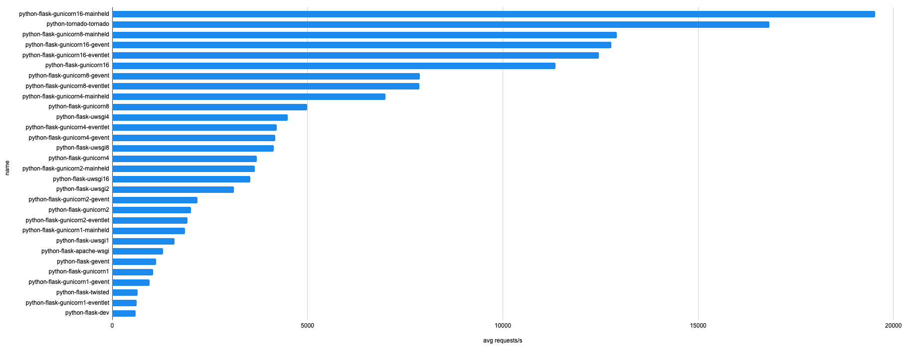

# Shush benchmarks 
Speed benchmarks for self-hosted url shortener in several languages and frameworks.

This is a research repository for benchmarking of very limited set of web
 technologies and frameworks. The purpose of the project is to help make
 framework choice for the [shush](https://github.com/tivvit/shush) project based on data.
  
The benchmarks were run on 16 cpu 8GB RAM virtual machine in Docker environment. 
 
Each server implementation is capable of loading redirect definitions from
 JSON file (1M urls) to memory and respond with appropriate http redirect
 or 404. 
 
Wrk was used for the testing (with params `-c64 -d5s -t8`) using lua script
 which preloads test urls selected from the known urls with exponential
 distribution.  
  
All results show number of requests per second handled by the server.

## Per language
Python

See all plots in `plots`

See all results in `reports`